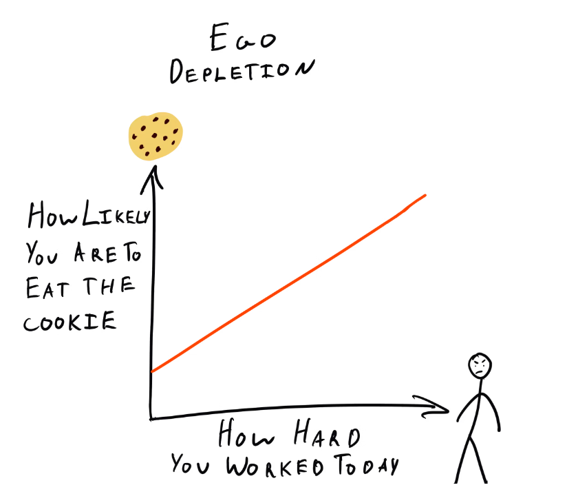

# Истощение эго

<figure><figcaption></figcaption></figure>

**Основная идея.**

&#x20;    Невозможно отрицать значительное влияние Зигмунда Фрейда на психологию. Хотя некоторые из его наиболее известных и спорных теорий утратили свою актуальность после его смерти в 1939 году, многие из его работ оказали огромное влияние на современную психологию. Одна из фрейдистских концепций - концепция эго - вдохновила современную психологическую концепцию истощения эго. Истощение эго утверждает, что в нашей личности есть три постоянно взаимодействующих аспекта. Первый - это ID, который включает в себя наши самые первичные побуждения и движим поиском удовольствия. Далее следует суперэго, которое связано с моралью и чувством правильного и неправильного, которому нас учат наши семьи и общество. И наконец, есть эго, задача которого заключается в посредничестве между конфликтующими интересами ID и суперэго, чтобы удовлетворить ид, не переступая моральных границ суперэго.

Согласно фрейдовской теории личности, эго постоянно работает над тем, чтобы держать ID в узде. Как и любая другая когнитивная задача, постоянные усилия эго по удовлетворению как ID, так и суперэго требуют психической энергии, которая ограничена. Самоконтроль можно представить себе как мышцу: когда она хорошо отдохнула, она сильна, однако при работе она устает и снова нуждается в отдыхе. Подобно тому, как мышца становится менее эффективной при нагрузке, способность эго к самоконтролю истощается и требует отдыха, прежде чем оно сможет снова работать.

Когда мы испытываем истощение эго, у нас не хватает психической энергии, чтобы принимать решения, требующие усилий, или удерживать себя от соблазнов. В результате мы можем сделать неправильный выбор и потерять продуктивность.

> В отличие от когнитивной нагрузки, истощение эго - это, по крайней мере, частичная потеря мотивации. После самоконтроля в одной задаче вам не хочется прикладывать усилия в другой, хотя вы могли бы это сделать, если бы действительно нуждались в этом. Дэниел Канеман

**Ключевые термины**

&#x20;   **ID**&#x20;

&#x20;   Согласно Фрейду, ID - это первая часть нашей личности, которая развивается и состоит из наших самых основных первичных и инстинктивных побуждений. Оно обитает в бессознательном, то есть мы не можем получить к нему доступ. ID мотивируется потребностью в удовольствии и удовлетворении и требует немедленного удовлетворения этих потребностей, невзирая на последствия. Если эти потребности не удовлетворяются, мы испытываем стресс и тревогу.

&#x20;    **Суперэго**

&#x20;    В то время как ид руководствуется принципом удовольствия, суперэго руководствуется принципом морали. Суперэго содержит совесть, наше интернализованное чувство правильного и неправильного, которое мы усваиваем в детстве от взрослых людей. Оно включает в себя мораль и идеалы, которые прививаются нам обществом с раннего возраста. Суперэго часто находится в конфликте с ID, поскольку ID может желать полностью игнорировать социальные нормы и моральные ценности, чтобы удовлетворить свои потребности, что приводит к переживанию тревоги.

&#x20;    **Эго**

&#x20;    Согласно фрейдистской теории личности, цель эго - обеспечить компромисс между ID и суперэго, чтобы желания ID были удовлетворены таким образом, который считается приемлемым для общества. И ID, и суперэго нереалистичны в своих требованиях, поэтому эго стремится найти разумную середину. Способность эго выступать в роли посредника между этими двумя противоположными силами Фрейд назвал «силой эго».Подобно мышце, сила эго истощается по мере ее использования. Когда эта психическая энергия иссякает, мы больше не в состоянии держать ID в узде, что приводит к принятию неверных решений и ухудшению работоспособности, связанным с истощением эго.

&#x20;    **Отсрочка удовлетворения**

&#x20;    Отсрочка удовлетворения - это способность отказаться от немедленного вознаграждения, чтобы получить большее вознаграждение позже. Например, человеку, стремящемуся бросить курить, чтобы улучшить свое здоровье, необходимо удержаться от соблазна закурить, чтобы достичь своей долгосрочной цели. Когда мы испытываем истощение эго, нам становится сложнее откладывать удовлетворение и отказываться от немедленного вознаграждения, даже если мы знаем, что это принесет нам пользу в долгосрочной перспективе.

**История**

&#x20;    Концепция истощения эго восходит к теории личности Фрейда, который предположил, что наша личность состоит из ID, эго и суперэго и что каждый из этих компонентов вносит свой уникальный вклад в то, кто мы есть и как мы действуем. Впервые эта теория была представлена в начале 1920-х годов. Хотя не Фрейд предложил термин «истощение эго», он, безусловно, заложил его основу.

Термин «истощение эго» стал использоваться спустя несколько десятилетий после того, как Фрейд впервые представил свою теорию личности. В 1998 году психолог Рой Баумейстер и его коллеги опубликовали работу под названием «Истощение эго: Является ли активное «я» ограниченным ресурсом?». В своем знаменитом исследовании Баумейстер и его коллеги предложили участникам шоколадное печенье, прежде чем попросить их выполнить сложное задание-головоломку. Они продемонстрировали, что те, кто отказывался от печенья, бросали головоломку гораздо быстрее, чем те, кто принимал его. Баумейтер и его коллеги объяснили это истощением эго, заявив, что отказ от печенья требовал силы воли, тем самым забирая у участников ограниченный запас психической энергии. Исследователи также предоставили доказательства того, что этот эффект не зависит от контекста, попросив участников провести презентацию, включающую мнения, которые либо противоречили, либо совпадали с их истинными убеждениями. Те, кто представил презентацию, включающую мнения, в которые они не верили, быстрее отказались от последующего задания-головоломки, чем те, кто представил презентацию, соответствующую их истинным убеждениям. Это объясняется тем, что для защиты мнения, в которое вы не верите, требуется больше умственной энергии, чем для защиты мнения, которого вы сами придерживаетесь.

**Последствия**&#x20;

&#x20;   Истощение силы воли может ухудшить нашу работоспособность, делая нас более склонными к импульсивному поведению. Оно может заставить людей охотнее употреблять алкоголь, что может иметь серьезные последствия для тех, кто борется с наркоманией, а также препятствовать попыткам бросить курить, поскольку им становится значительно труднее сказать «нет». Истощение эго может также снизить нашу продуктивность, поскольку нам не хватит силы воли, чтобы предпочесть продуктивные задачи приятным занятиям.

К счастью, истощения эго можно избежать. Стресс и усталость способствуют истощению эго, поэтому ключевую роль в его предотвращении играет забота о нашем психическом благополучии: мы должны высыпаться и заниматься деятельностью, которая снижает уровень стресса. Более того, когда мы испытываем истощение эго, сосредоточение на наших целях, а не на наших чувствах в данный момент, может стать полезным средством мотивации для отсрочки удовлетворения. Каждый день нам приходится принимать множество решений, некоторые из которых имеют огромное значение. Необходимо понимать факторы, которые могут повлиять на эти решения, чтобы принимать их наилучшим образом.

Кроме того, концепция истощения эго вдохновила на разработку когнитивного предубеждения, известного как усталость от принятия решений. Усталость от решений - это одна из форм истощения эго, которая означает нашу склонность принимать худшие решения, когда мы перегружены множеством вариантов. Чем больше решений мы принимаем, тем больше умственной энергии мы тратим и тем сильнее устают наши когнитивные способности.

**Противоречия**

&#x20;    Концепция истощения эго не является общепризнанной. Одни утверждают, что его последствия преувеличены, другие - что его вообще не существует. Недавно она оказалась под огнем, когда попытка повторить эпохальное исследование Баумейстера не дала результатов в пользу истощения эго.

Более того, исследование, проведенное стэнфордской исследовательницей Кэрол Двек, показало, что признаки истощения эго наблюдались только у тех участников, которые считали силу воли ограниченным ресурсом, что позволяет предположить, что истощение эго - это результат эффекта плацебо. Исследователи обеспокоены тем, что, если выводы Двек окажутся верными, распространение теории истощения эго может нанести реальный вред, мешая людям достигать своих целей или заставляя их принимать неверные решения.Майкл Инцлихт из Университета Торонто предполагает, что сила воли - это не ограниченный ресурс, а нечто сродни эмоциям. Точно так же, как мы не можем «исчерпать» гнев или счастье, мы не можем исчерпать силу воли. Он утверждает, что когда мы не мотивированы или у нас, кажется, заканчивается сила воли, это признак того, что текущая задача нас не увлекает. Именно поэтому мы можем постоянно проверять Instagram во время сухого чтения учебника, но при этом часами полностью погружаться в новейший роман любимого автора. Баумейстер ответил на эти аргументы против теории истощения эго наилучшим образом, на который способен исследователь, - заявив, что он и его коллеги продолжат исследования по этому вопросу, чтобы попытаться доказать, что эта концепция действительно существует.

**Примеры из практики**

&#x20;   **Роль физиологии**&#x20;

&#x20;   В последнее время психологи проводят исследования, направленные на раскрытие физиологических механизмов, лежащих в основе истощения эго. «Running on Empty: Neural Signals for Self-Control Failure», работа Майкла Инцлихта и Дженнифер Н. Гатселл, опубликованная в 2007 году, показала, что когда люди испытывают истощение эго, они демонстрируют более слабые сигналы негативизма, связанные с ошибками, - формы волн, которые можно зарегистрировать с помощью электроэнцефалограммы - распространенной методики, используемой для определения электрической активности в мозге. Другие исследования показывают, что люди с большей вариабельностью сердечного ритма, которая означает изменение времени между ударами сердца, демонстрируют меньший самоконтроль по сравнению с теми, у кого вариабельность сердечного ритма меньше. Исследования в этой области все еще относительно новые, и необходимо проделать большую работу, чтобы установить взаимосвязь между физиологическими факторами и самоконтролем.

&#x20;   **Плохие решения о покупках**

&#x20;   Исследования показали, что покупатели склонны принимать неверные решения, когда они испытывают истощение эго. Они могут импульсивно покупать дорогие вещи просто потому, что узнали название бренда, или просто покупать самый дешевый товар, чтобы избежать необходимости взвешивать все «за» и «против» различных доступных им вариантов. Хотя это позволяет им выполнить задачу быстро и без особых затрат своих уже истощенных умственных ресурсов, это не всегда приводит к лучшим потребительским решениям. Впоследствии покупатели могут оказаться неудовлетворенными своими покупками и пожалеть, что не сделали выбор по-другому.
